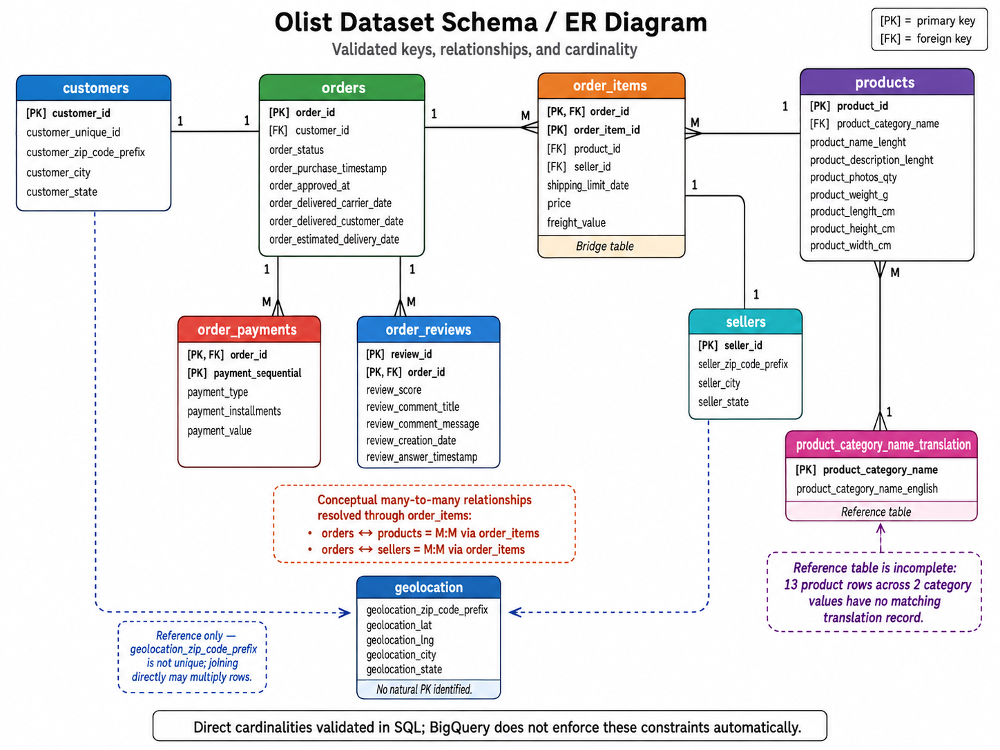
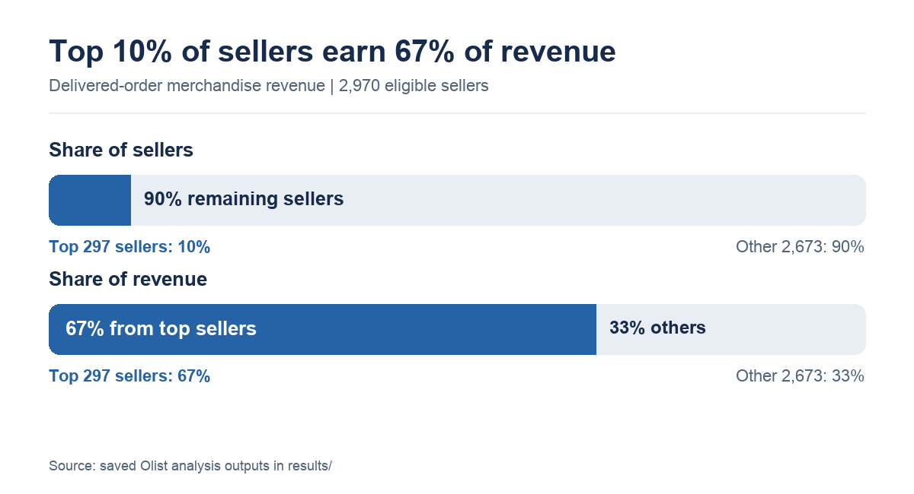
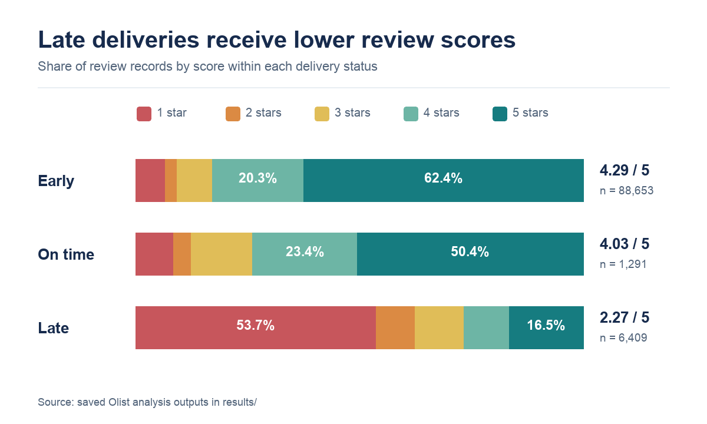
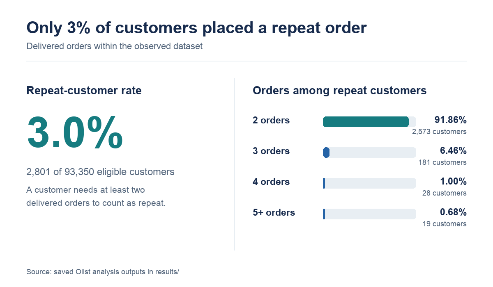

# Brazilian e-commerce SQL analysis

## Objective

I used BigQuery to answer seven questions about Olist's Brazilian e-commerce data. The SQL checks table relationships before analyzing delivery, revenue, products, sellers, reviews, and repeat customers. See the [findings](docs/findings.md) and [QA report](docs/qa_report.md) for detail.

## Dataset and tools

I loaded the nine CSV tables in the [Olist dataset](https://www.kaggle.com/datasets/olistbr/brazilian-ecommerce) into BigQuery and analyzed them with GoogleSQL. Git excludes the raw CSVs; `results/` holds 16 derived outputs.

Revenue is `SUM(order_items.price)` for delivered orders with a customer delivery date. It excludes freight and payment values and uses the delivery month. Other definitions are in the [methodology](docs/methodology.md).

## Schema

`order_items` links orders to products and sellers. Payments and reviews can each have multiple rows per order. The [schema reference](docs/schema.md) lists counts, keys, and join cardinalities.

## Business questions

| # | Question | SQL |
|---|---|---|
| 1 | How often are delivered orders late? | [Delivery analysis](sql/02_q01_delivery_analysis.sql) |
| 2 | How does monthly revenue change, and which months have the largest percentage changes? | [Revenue trend](sql/03_q02_revenue_analysis.sql) |
| 3 | Which customer states generate the most orders and revenue? | [State analysis](sql/04_q03_states_orders_revenue_analysis.sql) |
| 4 | How do product-category ranks differ by state and delivery month? | [Category analysis](sql/05_q04_product_category_analysis.sql) |
| 5 | How concentrated is revenue among sellers? | [Seller analysis](sql/06_q05_seller_analysis.sql) |
| 6 | How does delivery timing relate to review scores? | [Review analysis](sql/07_q06_delivery_review_analysis.sql) |
| 7 | How many customers place repeat delivered orders? | [Repeat-customer analysis](sql/08_q07_repeat_customer_analysis.sql) |

[Full question definitions](docs/business_questions.md)

## Selected findings
The analysis highlights three major patterns: strong seller-revenue concentration, a clear association between late delivery and poor reviews, and very limited repeat purchasing.

| Finding | Result |
|---|---|
| **Late delivery:** 6,534 of 96,470 eligible orders arrived after the estimated date, a **6.8%** late rate. | [Q1 summary](results/q01_late_delivery_summary.csv) |
| **Customer states:** São Paulo led with **40,494** delivered orders and about **5.07 million** in merchandise revenue. | [Q3 state results](results/q03_state_orders_and_revenue.csv) |
| **Seller concentration:** The top **297 of 2,970** eligible sellers generated about **67%** of revenue. | [Q5 seller share](results/q05_top10pct_seller_revenue_share.csv) |
| **Delivery and reviews:** Average review scores were **4.29** for early deliveries and **2.27** for late deliveries. | [Q6 averages](results/q06_avg_review_score_by_delivery_status.csv) |
| **Repeat customers:** **2,801 of 93,350** eligible customers placed more than one delivered order, or **3.0%**. | [Q7 repeat share](results/q07_repeat_customer_share.csv) |

The [full findings](docs/findings.md) also cover Q2 and Q4.

### Visual summary

## SQL skills demonstrated

- Validate keys and join cardinalities; aggregate at the right row grain.
- Use CTEs, temporary tables, conditional aggregation, `LAG()`, `RANK()`, `ROW_NUMBER()`, running `SUM()`, and `PERCENTILE_CONT()`.

## Limitations

- September and October 2018 have only 56 and 3 eligible delivered orders. They are poor full-month comparisons; early low-volume months also produce unstable percentage changes.
- Q6 counts review records, including multiple reviews on one order. Its delivery relationship is descriptive. Q7 measures repeat orders only within this dataset.
- Q5 seller rounding and seven Q4 `.50` category totals differ slightly from exact source sums; see the [QA report](docs/qa_report.md). The cleaned SQL was rerun in BigQuery and verified against the saved CSV outputs.

## Repository structure

| Path | Contents |
|---|---|
| `sql/` | Setup, validation, and Q1-Q7 analysis scripts |
| `docs/` | Questions, schema, methodology, findings, QA, and project notes |
| [`results/`](results/) | 16 derived CSVs |
| `images/` | Schema diagram and three finding charts |
| [`data/README.md`](data/README.md) | Raw-data download and loading notes; raw CSVs are ignored by Git |

## Reproduce the analysis

1. Download the [source CSVs](https://www.kaggle.com/datasets/olistbr/brazilian-ecommerce) and load the nine named tables shown in the diagram into BigQuery, using CSV headers as columns. Enable **Allow quoted newlines** for `order_reviews`.
2. Replace project `project-7ee2833b-bc0e-4b3d-9db` and dataset `olist_brazillian_ecommerce` throughout the SQL files with your own names. The dataset spelling in this project is intentional. Run [00_data_setup.sql](sql/00_data_setup.sql) only if the translation table imported with `string_field_*` columns and its header as data.
3. Run [01_data_validation.sql](sql/01_data_validation.sql), then each Q1-Q7 script above as a complete BigQuery script. Export each result to its matching filename in `results/` and compare with the saved CSVs and [QA report](docs/qa_report.md).
4. For the Q2 percentage-change summary, exclude the first month and September and October 2018 from the monthly trend, then select the largest positive and negative `monthly_revenue_change_pct` rows.
